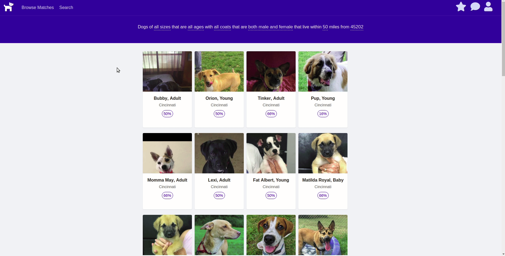
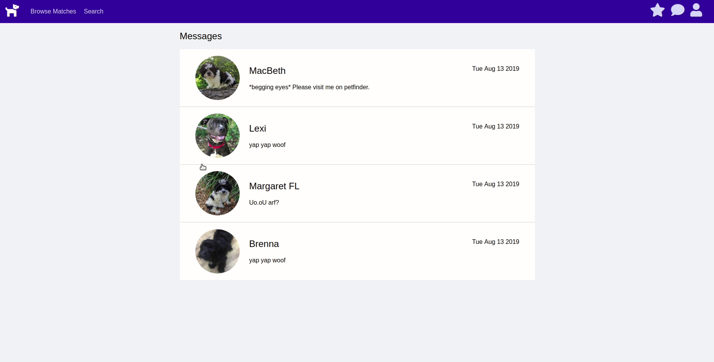

# OKFido

[Live Link](https://okfido.herokuapp.com)

## Overview
OKFido is a full stack clone of OKCupid that connects humans who want to adopt dogs with dogs seeking a home.

## Developers
[April Graves](https://github.com/AprilHGraves)

[Christie Brandao](https://github.com/cbrandao18)

## Technologies

* **Backend:** MongoDB/Express/GraphQL
* **Frontend:** React/Node.js/React-Apollo
* **Hosting:** Heroku
* TheDogAPI for breed info
* Petfinder API for adoptable dogs' info
* BCrypt for user authentication

## Media
* Reloading dogs list as search criteria are changed

* Viewing conversations and messaging dogs

* Answer a quick questionnaire when you sign up to tell us what dogs you're interested in

## Future Todos
* add a cute loading icon ( maybe a dog runs to a person or something :) )
* refactoring to make use of similiar components 
* add more search filters (breed)
* deleting likes / messages when the dog has already been adopted
* sorting results by match percent or other criteria
* user profile to change dog preferences, or zipcode, etc
